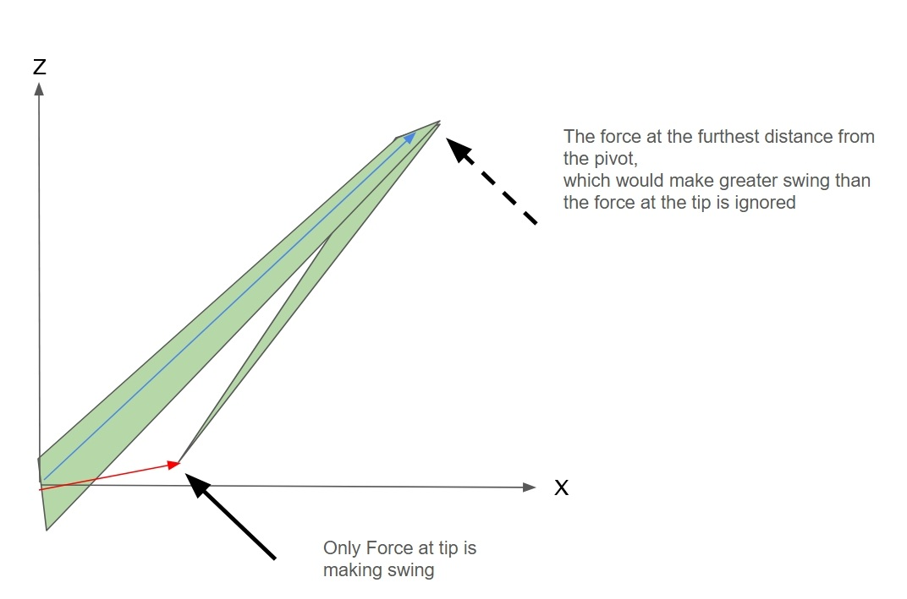

# 🌱 Grass Motion with Multi-Body Dynamics in Unreal Engine 5

> A physically-based grass animation system inspired by *Ghost of Tsushima*, implemented using Unreal Engine 5, Niagara, PCG, and multi-body dynamics.

## 📽️ Demo Video
[🔗 Watch on YouTube](https://youtu.be/5h7HZT5iuCI?si=WpGUy6z84sb_mj0Y)

  
  

## 🔗 Source Code
[GitHub Repository](https://github.com/donguklim/Ghost-of-Tsushima-Grass-plus-Rotational-Dynamics) – includes README with algorithmic details.

---

# 🎯 Project Goals

- Implement grass in the style of *Ghost of Tsushima* using Unreal Engine 5
- Achieve physics-based grass motion

After watching the [presentation](https://youtu.be/Ibe1JBF5i5Y?si=W0vj9MOF8JJ87BsB) by Sucker Punch Studio at GDC, I decided to recreate the grass effect shown using Unreal Engine.

The GDC presentation did not detail how the grass motion was achieved. Thus, I added a goal to implement physics-based motion.

---

# 🌾 Ghost of Tsushima Grass and Implementation Process

## Bezier Curve-based Grass Modeling in Ghost of Tsushima

The grass uses models based on Bezier curves, which can be controlled using a certain number of points.

Grass movement is realized by adjusting the angles of line segments connecting these Bezier points. Unlike the image above, Ghost of Tsushima employs a degree-4 Bezier curve consisting of three line segments.

## Grass Modeling Using Material Shader
- Implemented a rendering model with square 2D meshes by adjusting WPO (World Position Offset) within UE5’s material shader.
- Unlike Ghost of Tsushima, a degree-3 Bezier curve (as in the image above) was used for modeling.
- The angle of the joint at ground-level (P0) was adjusted using the instance's transformation.
- The angle of joint P1 was adjusted using WPO.

Choosing a degree-3 Bezier curve instead of a higher degree curve (as used in Ghost of Tsushima) reduces the required resources and offers another significant advantage. 

It allows the curve length to be calculated using an existing formula.

## Adjusting Grass Length

Bezier curves have the following characteristics:
- Changing the joint angle changes the curve length.
- Bezier curves of degree greater than 3 do not have an analytic equation to calculate curve length.
  - The curve length must be calculated numerically.

Ghost of Tsushima uses degree-4 Bezier curves, and grass blades have varying lengths.

In the GDC presentation, the developer mentioned that the variation in grass length is not very noticeable, so they left it as is.

However, in simulations with strong wind forces and large noise amplitudes, the varying movement makes the length change more apparent.

In my implementation, I used a degree-3 Bezier curve, which maintains consistent grass lengths.

---

Initially, I assumed a formula for calculating the length of a degree-3 Bezier curve must already exist since Bezier curves are common, but I couldn't find one through a Google search.

So, I invested several hours to derive the formula myself.

[Derivation Process for the Length Calculation Formula](https://github.com/donguklim/Ghost-of-Tsushima-Grass-plus-Rotational-Dynamics?tab=readme-ov-file#quadratic-bezier-curve-length-control)

---

Got it! Here's your original markdown with grammar corrections and improved natural phrasing. I’ve preserved your formatting:

---

# Creating Grass at Runtime in a Hierarchical Structure

Ghost of Tsushima's grass has a hierarchical structure.

Within a large grid, smaller grids at lower levels are nested, and grass within each grid is generated or destroyed at runtime depending on the distance from the camera.

The larger the grid size, the lower the grass density, and the farther the generation/destruction distance from the camera.  
Conversely, the smaller the grid size, the higher the grass density, and the shorter the generation/destruction distance.

This was easily implemented using Unreal Engine's PCG hierarchical grid system and runtime generation.

## Region Generation Based on Voronoi Diagrams

  
**Voronoi Diagram Example:** Locations that share the same closest point belong to the same region.

In Ghost of Tsushima, regions were distinguished using Voronoi diagrams, and the grass in each region shared common characteristics (length, shape, direction, etc.) with per-instance noise added.

Although I do not know exactly how Sucker Punch Studio implemented it, I also used Voronoi diagrams to make grass within the same region share the following characteristics:  
Shared characteristics:
- Grass length
- Width
- Rigidity
- Directional flow (using Perlin noise with different random seeds per region to generate direction)
- Color noise
- Instance density

Some characteristics were set to transition gradually using linear interpolation:
- Instance density
- Grass length

In the image below, the white boxes are located at the center points of the Voronoi regions.

  
**Grass Voronoi Diagram Region Example:** Box meshes are Voronoi center points. Three regions have different colors, shapes, densities, and directional flows.

  
**Linear Interpolation Example:** Grass length gradually changes from the center (white box) to the boundary.

Voronoi center points are generated using PCG.  
Each point that becomes a grass instance calculates its distance to the set of Voronoi center points and inherits the attributes of the center point of the region it belongs to.  
Basic PCG only supports calculating the distance to the nearest point in a point set, but does not provide functionality to retrieve attributes from that nearest point.

To retrieve attributes from the closest point in another point set, a third-party plugin called **PCG Extended Toolkit** can be used.

For linear interpolation, each grass instance point also retrieves the distance and attributes of the second closest Voronoi region in addition to those of the region it belongs to.  
Linear interpolation is then performed using both sets of values.

## Wind Simulation

Wind is generated using a layered gradient noise function.  
A UI allows adjustment of the base wind force, and noise-based force is added on top of it.  
The direction of the moving noise is set to match the base wind force direction.

# ⚙️ Physics-Based Motion Implementation

While researching papers on grass motion, I found the ID3 paper ([Grass Swaying with Dynamic Wind Force](https://dl.acm.org/doi/10.1145/2856400.2876008)), which uses Bezier curve-based grass animation—just like Ghost of Tsushima.

Initially, I tried to implement exactly what was described in the paper, but the paper had several issues.  
Eventually, my implementation used completely different calculations and algorithms from those in the paper.

## Basic Dynamics

In the reference paper, each joint has elasticity that creates a restoring torque to return it to its original shape.  

The angular acceleration resulting from wind force torque and air friction torque is calculated every frame.  

Motion is then created using a dynamics-based approach, updating angular velocity and angular displacement using the computed angular acceleration.

---

### Forces Due to Wind and Air Friction
When a specific surface makes contact with air, forces are calculated as follows:
1. Force due to air friction = $-cs\overrightarrow{v}$
  - c is the air friction coefficient. A higher coefficient means the current air density is higher.
  - $\overrightarrow{v}$ is the velocity of p.
  - s is the area in contact with air.
2. Force due to wind = $s\overrightarrow{W}$
  - Here too, s represents area.
  - $\overrightarrow{W}$ refers to the force per area of wind.

### Basic Assumptions About Restoration Force

1. P0 is a ball joint that can rotate on any axis
2. P1 is a hinge joint that can only rotate on a predetermined local axis of the grass
3. Each joint has elasticity and creates restoration torque proportional to angular displacement.
  - Restoration Torque = $-k\overrightarrow{\Delta\theta}$
  - k = joint strength
  - $\overrightarrow{\Delta\theta}$ = angular displacement of grass. The vector direction indicates the rotation axis, and the vector length indicates the rotation angle. Left hand rule is used.

Thanks for the detailed markdown. Here's your revised version with grammar and natural phrasing improved throughout while keeping your technical tone and markdown structure intact:

---

## Problems with the Reference Study

### Inaccurate Restoration Torque Calculation Method

The author calculated the restoration torque in an unconventional way, creating [a relationship between angular displacement and restoration torque that is neither linear nor monotonic](https://github.com/donguklim/Ghost-of-Tsushima-Grass-plus-Rotational-Dynamics/blob/main/README.md#inconsistent-restoration-force-direction).  
The formula causes the restoration torque to gradually drop to zero as the grass bends up to a certain angle, then increase again with further bending.

The author does not provide any justification for this behavior. It appears to be a simple mistake.

### Inaccuracy from Treating Forces as Point Forces

Wind and air friction forces act along the entire Bezier curve segment. However, the author of the paper treats these forces as if they act at the endpoint of each segment when calculating torque.  
Additionally, when calculating the air friction force, the author mistakenly uses angular velocity instead of computing the actual velocity at the end of the bar.

To calculate torque correctly, [integration over the entire segment is required](https://github.com/donguklim/Ghost-of-Tsushima-Grass-plus-Rotational-Dynamics/blob/main/README.md#wind-and-air-friction-are-not-point-forces).

### Ignoring Physical Interactions Between Connected Bars

The method used by the paper's author for calculating angular acceleration completely neglects the recoil or dragging effects caused by the presence of joints.

### Contradictory Additional Procedure

The author of the paper uses several additional procedures to prevent the grass from exhibiting motion inconsistent with wind. However, some of these procedures exacerbate the problems mentioned above, creating even worse synergy effects.

Specifically, the author calculates the torque between the ground and the grass joint using the following additional method:

- The joint with the ground is restricted as a universal joint (rotating only around the ground's normal axis and the grass's local Y-axis).
- The torque experienced by this joint is calculated based only on the force applied at the tip of the grass blade.

As shown in the figure above, when wind applies force causing the grass to rotate around the Z-axis:

- The torque applied to the grass is calculated based on the force at the grass tip, marked by the red vector.
- The wind force acting on the point indicated by the blue vector is ignored.

Torque increases proportionally with the distance from the joint. 
Thus, the grass in the above scenario receives significantly less torque than it actually should.

In an extreme scenario, if the tip of the grass touches the base, 
the distance between the joint and the point of wind force application becomes zero, resulting in zero torque being applied to the grass.

## 🧩 How I Came to Implement the ABA Algorithm

Before adopting ABA, here's what I went through:

1. I asked Claude AI what this kind of problem is called and what keywords I should use to research it.
2. Claude AI initially suggested the keyword **Multi-Bar Linkage System**.
3. Using that keyword, I deepened my understanding of torque, free-body diagrams, etc.—but still couldn’t find a clear solution.
4. I spent two weeks drawing free-body diagrams and writing out math formulas to come up with my own original algorithm.
5. After a Claude AI update, I asked again and received the keyword **Multi-body Dynamics**.

Multi-body Dynamics is a field that studies the motion of rigid bodies connected by joints or linkages.

It was exactly the field I needed.

When I asked Claude why it hadn’t mentioned it earlier, it responded that it had only recently been updated with knowledge of Multi-body Dynamics and robotics.

Over the next 4–5 days, I studied the fundamentals of Multi-body Dynamics  
and discovered that the most efficient algorithm for my use case was the **Articulated Body Algorithm (ABA)**.

## 📌 My Inaccurate Original Algorithm – The Payback Method
---

This section outlines an algorithm I created on my own and how it worked.

Since the algorithm was later replaced due to inaccuracy, you can skip this part if you're not interested in the process.

Still, I spent two weeks on it, so here's what I did:

---

Using the keywords suggested by Claude, I learned how to draw free-body diagrams and gained deeper insight into torque.  
However, I still couldn’t find a method for systems like Bezier-curve-based grass, where one end is free rather than fixed.

As a result, I came up with my own method, which I called the [Payback Algorithm](https://github.com/donguklim/Ghost-of-Tsushima-Grass-plus-Rotational-Dynamics/blob/main/README.md#payback-moment-algorithm), based on the following reasoning:

1. I didn’t know how to compute torque and angular acceleration when there's a P1 joint.
2. But if restoration torque, air friction, and wind torque cancel out to a net torque of zero and the P1 joint remains stationary, I could assume the bars move as if P1 doesn’t exist.
3. So, I decided to “lend” torque to P1 to make the net torque zero, calculate acceleration, then “take it back” to rotate Bar2. But I also had to consider the inertial torque caused when P1 starts moving.
4. I didn’t know how to compute Bar2’s angular acceleration when P1 isn’t fixed.
5. As in Step 3, I “lent” torque to P0 to hold P1 fixed, computed P1’s angular acceleration, then considered the recoil effect when taking torque back from P0.
6. I also needed to take back the torque lent to P0, leading me back to Step 3.

The idea was to approximate angular acceleration by successively lending torque to hold joints stationary, then taking it back.  
Since this could loop infinitely, I limited the number of iterations.

Later, I realized that instead of enforcing net-zero torque, I could treat the system as a linear system that accounts for the recoil caused by these torque transfers—potentially approximating an infinite feedback loop.

Both the linear system solution and the limited Payback iteration method produced somewhat plausible motion.

## 🦾 Articulated Body Algorithm

This is the most efficient simulation algorithm known in Multi-body Dynamics. It accurately simulates angular acceleration by accounting for the forces transmitted across joints.

For detailed explanations, refer to Professor Roy Featherstone’s book:  
[Rigid Body Dynamics Algorithms](https://link.springer.com/book/10.1007/978-1-4899-7560-7).

This is now the default algorithm used in this project.  
Although my original algorithm remains as an optional feature, I’m likely to discard it later.

## 🛑 Maximum Angular Displacement Limitation

Real grass can't twist or rotate infinitely.  
I implemented a maximum angular displacement limit on each axis.  
When this threshold is reached, the angular velocity is clamped to zero.

[Angular Displacement Limitation Algorithm Link](https://github.com/donguklim/Ghost-of-Tsushima-Grass-plus-Rotational-Dynamics/blob/main/README.md#angular-displacement-magnitude-limitation-on-p0)

## 🚧 Ground Collision Handling

Ground collision is handled by checking if the dot product between the ground normal and the Bar1 direction stays above a certain threshold.  
If the threshold is reached, the velocity is set to zero.

[Ground Collision Algorithm Link](https://github.com/donguklim/Ghost-of-Tsushima-Grass-plus-Rotational-Dynamics/blob/main/README.md#ground-collision)

---

# 🛠️ System Integration

## Combination of Dynamic Motion and Ghost of Tsushima Grass

Since dynamic motion was utilized, each grass instance stores its angular velocity and angular displacement. To easily implement this, Niagara is necessary.

Niagara emitters are created via Niagara Data Channels (NDC), with PCG writing grass point data directly into these NDCs.

## Utilizing PCG + NDC Data Channels
Writing data from PCG to NDC is a recently added feature by Epic Games, accessible through an experimental-stage plugin. As this is a newly introduced feature, there were no existing tutorials or guides available. I went through a trial-and-error process to document its usage, ultimately creating a tutorial video to assist others.

[🔗 PCG + Niagara Data Channel Tutorial](https://youtu.be/C1LmzQKNnzI)

### Cleaning Up PCG and Niagara Particles

Unlike when using PCG with Static Mesh Spawners, PCG cannot directly delete Niagara particles. PCG can only write data into NDC.

Since PCG repeatedly sends particle data to NDC based on camera position, duplicate grass instances will appear if Niagara emitters do not remove unnecessary particles. Therefore, emitters must be capable of cleaning up unused particles or their own emitter instances.

In the current implementation, emitters remove particles using the following methods:
1. Removing particles based on the distance between the camera and the PCG grid to which they belong.
2. Removing particles based on a comparison between particle creation time and the last data write time by PCG.

You can see a detailed explanation in the [tutorial video](https://youtu.be/C1LmzQKNnzI).

# 📈 Implementation Summary and Performance

## Project Summary
- Based on the *Ghost of Tsushima* GDC presentation
- Fully real-time grass generation and motion system using hierarchical PCG + Niagara + physics
- Enhanced physical realism with the **Articulated Body Algorithm (ABA)**
- Implemented unique improvements, including:
  - Fixed-length grass via **Quadratic Bézier Curve**
  - Physics-based dynamic motion using ABA
  - Physical constraints for joint angle displacements
  - Grass blade twist based on angular displacement

## ⚔️ Comparison with *Ghost of Tsushima*

| Feature                         | Ghost of Tsushima    | My Implementation                        |
|---------------------------------|----------------------|------------------------------------------|
| Bézier Curve Type               | Cubic (4-point)      | Quadratic (3-point)                      |
| Grass Length                    | Uncontrolled (varies)| Fixed                                    |
| Motion                          | Unknown              | Multi-body forward dynamics using ABA    |
| Hierarchical Runtime Generation | Custom Engine        | UE5 PCG + Niagara Data Channel Interface |

## Key Features

### Grass Modeling & Optimization
- **Hierarchical PCG grid** for runtime spawning and cleanup
- **Quadratic Bézier Curve** used for grass blades
  - Fixed length maintained, unlike the cubic version used in *Ghost of Tsushima*

  
**Bezier Curve Grass Example:** P0 and P1 Bézier points function as rotational joints.

### 💨 Wind & Motion Simulation
- Wind simulated via noise functions
- Skeleton-based articulation:
  - P₀: Ball joint (3 DOF)
  - P₁: Hinge joint (1 DOF)
- Elastic recovery toward initial pose, with randomized stiffness
- Forces:
  - Wind force (adjustable via UI)
  - Air friction (adjustable via UI), acting as a damping force
  - Restoration force from grass joints

### ⚙️ Physics System
- Referenced but improved upon [I3D paper](https://dl.acm.org/doi/10.1145/2856400.2876008)
- Discarded inaccurate or unstable parts of the original paper
- Replaced with:
  - **Forward Dynamics via Articulated Body Algorithm (ABA)**
  - Maximum angular displacement  limit constraints
  - Ground collision handling
---

## Motion Comparison

### Motion Under Strong Wind Force

**Before Maximum Angular Displacement Limit and Collision**

  
[🔗 Watch on YouTube](https://youtu.be/sHjHLRHukEs)  
[🔗 Start at wind force 40 scene](https://youtu.be/sHjHLRHukEs?si=raVWfqdE0HeZyLcM&t=68)

**After Maximum Angular Displacement  Limit and Collision**

  
[🔗 Start at wind force 40 scene](https://youtu.be/5h7HZT5iuCI?si=dYmNk5WoUefEqJj9&t=36)

Without angular displacement limits and collision:
1. Grass can store unlimited restoration force as it can rotate and twist infinitely
   - (In reality, grass blades would be just broken already)
2. Resulting motion becomes inconsistent with wind behavior

### Reference Study Motion

Results after modifying the reference paper, including:
- Fixing calculation errors
- Removing inaccurate acceleration calculation and inconsistent algorithms and replacing with:
  - acceleration calculation with ABA 
  - Angle limit constraints
  - Ground collision handling
- Fixed grass length

[🔗 Watch on YouTube](https://youtu.be/qu_WTiCiIrc)  
[]

The grass tends to align into straight lines under strong wind.

---

## Performance

FPS was measured using the [GitHub sample project](https://github.com/donguklim/Ghost-of-Tsushima-Grass-plus-Rotational-Dynamics),  
with a **fixed cleanup multiplier (1.1)** and varying **PCG sampling rates** per grid size.  
Each grid size used a fixed generation radius, shown below:

| PCG Grid Size | Generation Radius |
|---------------|-------------------|
| 400           | 1600              |
| 800           | 3200              |
| 1600          | 6000              |
| 3200          | 8000              |

> *(“n SR” = Sampling Rate for grids of size n)*  
> FPS was measured a few seconds after beginning play.

---

### 📊 FPS Results (Across Sampling Rates per square meter for each grid Size) with RTX 2080 TI

| **FPS Range** | **400 SR** | **800 SR** | **1600 SR** | **3200 SR** |
|---------------|------------|------------|-------------|-------------|
| 60 – 70       | 32         | 16         | 8           | 4           |
| 65 – 75       | 16         | 8          | 4           | 2           |
| 68 – 78       | 8          | 4          | 2           | 1           |
| 75 – 80       | 2          | 1          | 1           | 1           |
---

## 🔮 Future Work
- Use render targets or additional NDC to allow interaction with other actors including the player
- Add grass particle blow effects
- Improve grass models with more varied shapes
- Improve optimization (possibly using Nanite)
- Improve shadows
- Point Generation within NDC or Compressed Point Data from PCG
  - Currently, all grass generation points are sent from PCG to the NDC.
  - To reduce communication overhead between PCG and NDC, either compressing the point data or letting the Niagara emitter decide where to generate points could be considered.
  - However, this approach may limit the level of control over grass positions and attributes within the PCG.

---

# 🛠️ Plugins Used
- Niagara
- PCG
- PCGNiagaraInterop (experimental)
  - Allows PCG to write to NDC
- PCGExtendedToolkit
  - Used to create Voronoi diagram regions

---

# 📚 References

- [GDC Presentation – Procedural Grass in *Ghost of Tsushima*](https://youtu.be/Ibe1JBF5i5Y?si=EbGqmGS29uNdBPUn)
- [I3D Paper – Grass Swaying with Dynamic Wind Force](https://link.springer.com/article/10.1007/s00371-016-1263-7)
- [Unreal Engine Documentation – Niagara Data Channels Intro](https://dev.epicgames.com/community/learning/tutorials/RJbm/unreal-engine-niagara-data-channels-intro)

---

# Other Portfolios

- [Implementation Photon Mapping & Disney's Photon Beam PBR with DirectX 12](https://github.com/donguklim/DirectX12PhotonBeam)
- [Implementation Photon Mapping & Disney's Photon Beam PBR with Vulkan](https://github.com/donguklim/vk_raytracing_tutorial_KHR/tree/master/photon_beam)
