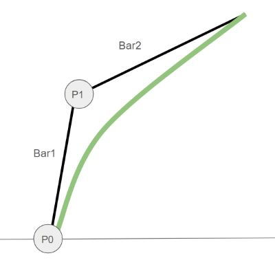

# 🎮 Grass Motion with Multi-Body Dynamics in Unreal Engine 5

> A physically-based grass animation system inspired by *Ghost of Tsushima*, implemented using Unreal Engine 5, Niagara, PCG, and multi-body dynamics.

## 📽️ Demo Video
[🔗 Watch on YouTube](https://youtu.be/5h7HZT5iuCI?si=WpGUy6z84sb_mj0Y)

  
  

## 🔗 Source Code
[GitHub Repository](https://github.com/donguklim/Ghost-of-Tsushima-Grass-plus-Rotational-Dynamics) – includes README with algorithmic details.

---

## Project Goal
- To implement *Ghost of Tsushima*-style grass using Unreal Engine 5
- To demonstrate the capabilities of the Niagara Data Channel (NDC) and PCG combination in a real-time GPU simulation of a large number of instances.

---

## 🧠 Project Summary

- Based on the *Ghost of Tsushima* GDC presentation
- Fully real-time grass generation and motion system using hierarchical PCG + Niagara + physics
- Enhanced physical realism with the **Articulated Body Algorithm (ABA)**
- Implemented unique improvements, including:
  - Fixed-length grass via **Quadratic Bézier Curve**
  - Physics-based dynamic motion using ABA
  - Physical constraints for joint angle displacements
  - Grass blade twist based on angular displacement

---

## 🛠️ Key Features

### 🌱 Grass Modeling & Optimization
- **Hierarchical PCG grid** for runtime spawning and cleanup
- **Quadratic Bézier Curve** used for grass blades
  - Fixed length maintained, unlike the cubic version used in *Ghost of Tsushima*

  
**Bezier Curve Grass Example:** P0 and P1 Bézier points function as rotational joints.

### 💨 Wind & Motion Simulation
- Wind simulated via noise functions
- Skeleton-based articulation:
  - P₀: Ball joint (3 DOF)
  - P₁: Hinge joint (1 DOF)
- Elastic recovery toward initial pose, with randomized stiffness
- Forces:
  - Wind force (adjustable via UI)
  - Air friction (adjustable via UI), acting as a damping force
  - Restoration force from grass joints

### ⚙️ Physics System
- Referenced but improved upon [SIGGRAPH paper](https://dl.acm.org/doi/10.1145/2856400.2876008)
- Discarded inaccurate or unstable parts of the original paper
- Replaced with:
  - **Forward Dynamics via Articulated Body Algorithm (ABA)**
  - Maximum angular displacement  limit constraints
  - Ground collision handling

---

## 🔌 Niagara Data Channel + PCG Integration

- Niagara emitters dynamically spawned based on the PCG grid
- ABA-based motion data (angular velocity, acceleration, displacement) calculated in Niagara
- Emitters and particles cleaned up based on camera position
- Custom workflow:
  - PCG writes to the **Niagara Data Channel**
  - Niagara interprets and visualizes in real time
  - Niagara emitter instances kill particles or themselves based on camera position and direction

---

## 🦾 Motion Comparison

### Motion Under Strong Wind Force

**Before Maximum Angular Displacement Limit and Collision**

  
[🔗 Watch on YouTube](https://youtu.be/sHjHLRHukEs)  
[🔗 Start at wind force 40 scene](https://youtu.be/sHjHLRHukEs?si=raVWfqdE0HeZyLcM&t=68)

**After Maximum Angular Displacement  Limit and Collision**

  
[🔗 Start at wind force 40 scene](https://youtu.be/5h7HZT5iuCI?si=dYmNk5WoUefEqJj9&t=36)

Without angular displacement limits and collision:
1. Grass can store unlimited restoration force as it can rotate and twist infinitely
   - (In reality, grass blades would be just broken already)
2. Resulting motion becomes inconsistent with wind behavior

### Reference Study Motion

Results after modifying the reference paper, including:
- Fixing calculation errors
- Removing inconsistent algorithms and replacing with:
  - Angle limit constraints
  - Ground collision handling
- Fixed grass length

[🔗 Watch on YouTube](https://youtu.be/qu_WTiCiIrc)  
[]

The grass tends to align into straight lines under strong wind.

---

## 🧪 Procedural Variation with Voronoi

  
**Voronoi Diagram Example:** Locations sharing the same nearest point belong to the same region.

PCG-generated Voronoi regions used to assign:
- Grass length
- Grass width
- Stiffness
- Initial direction
- Color noise
- Population density

Smooth transitions between regions using linear interpolation for:
- Population density
- Grass length

  
**Grass Voronoi Region Example:** Box meshes mark Voronoi points. Three regions with different colors, shapes, and population densities.

  
**Region Linear Interpolation Example:** Gradual change in grass length from region center (white box) to boundary.

---

## ⚔️ Comparison with *Ghost of Tsushima*

| Feature                         | Ghost of Tsushima    | My Implementation                        |
|---------------------------------|----------------------|------------------------------------------|
| Bézier Curve Type               | Cubic (4-point)      | Quadratic (3-point)                      |
| Grass Length                    | Uncontrolled (varies)| Fixed                                    |
| Motion                          | Unknown              | Multi-body forward dynamics using ABA    |
| Hierarchical Runtime Generation | Custom Engine        | UE5 PCG + Niagara Data Channel Interface |

---

## 🤔 Challenges & Solutions

### Finding a Physically Accurate Algorithm

I noticed the reference paper ignored several physical factors, but I didn’t know how to accurately calculate them.

#### Solution

1. Asked an AI (Claude)
2. It gave unreliable, hallucinated answers
3. Asked what the common term for this problem is and which field I should study
4. It gave the keyword "Multi-body dynamics"
5. Googled it and found it was exactly the field I needed
6. Studied multi-body dynamics basics and tutorials for 4 days
7. Gained enough knowledge to implement ABA

### PCG with Niagara Particle Cleanup

Unlike static mesh spawners, PCG cannot directly clean up Niagara particles.  
Niagara emitters must handle cleanup to prevent duplicated grass.

#### Solutions

1. Kill particles based on distance between the camera and the PCG grid the particle belongs to
2. Kill particles based on a comparison between their spawn time and the last time PCG sent data to the emitter
  - Requires NDC extent to match PCG grid size
  - May fail if the character moves extremely fast or teleports
  - Details in my [custom tutorial video](https://youtu.be/C1LmzQKNnzI)

Since writing to NDC from PCG was a new feature without documentation, I figured it out through trial and error.

So, I made a tutorial video to help others:  
[🔗 PCG + Niagara Data Channel Tutorial Video](https://youtu.be/C1LmzQKNnzI)

---

## 🔮 Future Work
- Use render targets or additional NDC to allow interaction with other actors including the player
- Add grass particle blow effects
- Improve grass models with more varied shapes
- Improve optimization (possibly using Nanite)
- Improve shadows

---

## 🛠️ Plugins Used
- Niagara
- PCG
- PCGNiagaraInterop (experimental)
  - Allows PCG to write to NDC
- PCGExtendedToolkit
  - Used to create Voronoi regions

---

## 📚 References

- [GDC Presentation – Procedural Grass in *Ghost of Tsushima*](https://youtu.be/Ibe1JBF5i5Y?si=EbGqmGS29uNdBPUn)
- [SIGGRAPH Paper – Grass Swaying with Dynamic Wind Force](https://link.springer.com/article/10.1007/s00371-016-1263-7)
- [Unreal Engine Documentation – Niagara Data Channels Intro](https://dev.epicgames.com/community/learning/tutorials/RJbm/unreal-engine-niagara-data-channels-intro)
---

## Other Portfolios

- [Implementation Photon Mapping & Disney's Photon Beam PBR with DirectX 12](https://github.com/donguklim/DirectX12PhotonBeam)
- [Implementation Photon Mapping & Disney's Photon Beam PBR with Vulkan](https://github.com/donguklim/vk_raytracing_tutorial_KHR/tree/master/photon_beam)
- 