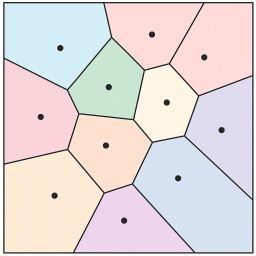

# 🎮 Grass Motion with Multi-Body Dynamics in Unreal Engine 5

> A physically-based grass animation system inspired by *Ghost of Tsushima*, implemented using Unreal Engine 5, Niagara, PCG, and multi-body dynamics.

## 📽️ Demo Video
[🔗 Watch on YouTube](https://youtu.be/5h7HZT5iuCI?si=WpGUy6z84sb_mj0Y)

  
  

## 🔗 Source Code
[GitHub Repository](https://github.com/donguklim/Ghost-of-Tsushima-Grass-plus-Rotational-Dynamics) – includes README with algorithmic details.

---

# 🎯 Project Goals

- Implement grass in the style of *Ghost of Tsushima* using Unreal Engine 5
- Achieve physics-based grass motion

After watching the [presentation](https://youtu.be/Ibe1JBF5i5Y?si=W0vj9MOF8JJ87BsB) by Sucker Punch Studio at GDC, I decided to recreate the grass effect shown using Unreal Engine.

The GDC presentation did not detail how the grass motion was achieved. Thus, I added a goal to implement physics-based motion.

---

# 🌾 Ghost of Tsushima Grass and Implementation Process

## Bezier Curve-based Grass Modeling in Ghost of Tsushima

The grass uses models based on Bezier curves, which can be controlled using a certain number of points.

Grass movement is realized by adjusting the angles of line segments connecting these Bezier points. Unlike the image above, Ghost of Tsushima employs a degree-4 Bezier curve consisting of three line segments.

## Grass Modeling Using Material Shader
- Implemented a rendering model with square 2D meshes by adjusting WPO (World Position Offset) within UE5’s material shader.
- Unlike Ghost of Tsushima, a degree-3 Bezier curve (as in the image above) was used for modeling.
- The angle of the joint at ground-level (P0) was adjusted using the instance's transformation.
- The angle of joint P1 was adjusted using WPO.

Choosing a degree-3 Bezier curve instead of a higher degree curve (as used in Ghost of Tsushima) reduces the required resources and offers another significant advantage.
It is the fact that there exists the equation for calculating the curve length.

## Adjusting Grass Length

Bezier curves have following characteristics
- change of joint angle changes the curve length
- Bezier curves with degree greater than 3 does not have an analytic equation to calculate the curve length
  - the curve length can only be calculated with numerical method

Ghost of Tsushima is using degree 4 Bezier curves and grasses have varying lengths.

In the GDC presentation, the developer of the game said that the grass length change is not really evident so they just left it as it is.

However, in simulations with stronger winds force and large noise amplitude, grasses will show more varying movement making the length change evident.

In my implementation, I used a degree-3 Bezier curve, maintaining consistent grass lengths. 

---

Initially, I assumed the equation for calculating degree 3 Bezier curve length must already exist since Bezier curve is popular, but I couldn't find the equation via Google search.

Thus, I invested several hours to derive the length calculation equation myself.

[Derivation Process for the Length Calculation Formula](https://github.com/donguklim/Ghost-of-Tsushima-Grass-plus-Rotational-Dynamics?tab=readme-ov-file#quadratic-bezier-curve-length-control)

---

# Creating Grass at Runtime in a Hierarchical Structure

Ghost of Tsushima's grass has a hierarchical structure. 

Within a large-sized grid, smaller grids at lower levels are included, and the grass in each grid is generated/destroyed at runtime depending on the distance from the camera.

The larger the grid size, the lower the density of grass, and the longer the distance from the camera for generation/destruction.
Conversely, the smaller the grid size, the higher the density of grass, and the shorter the generation/destruction distance.

This was easily implemented using Unreal Engine's PCG hierarchical grid system and runtime generation.

## Region Generation Based on Voronoi Diagrams

  
**Voronoi Diagram Example:** Locations that share the same closest point belong to the same region.

In Ghost of Tsushima, regions were distinguished using Voronoi diagrams, and the grass in each region shared common characteristics (length, shape, direction, etc.) with noise added to individual instances.

Although I do not know exactly how Sucker Punch Studio generated it, I also used Voronoi diagrams to make grass in the same region share the following characteristics:
Shared characteristics:
- Grass length
- Width
- Rigidity
- Flow of direction (using Perlin noise with different random seeds for each region to generate direction)
- Color noise
- Instance density

Some characteristics were set to transition gradually using linear interpolation:
- Instance density
- Grass length

In the image below, the white boxes are located at the center points of the Voronoi diagram regions.

  
**Grass Voronoi Diagram Region Example:** Box meshes are Voronoi diagram point positions. Three regions have different colors, shapes, densities, and directional flows.

  
**Linear Interpolation Example:** Grass length gradually changes from the center (white box) to the boundary.

Voronoi center points are generated using PCG.
Each point that will become a grass instance calculates its distance to the set of points that will become center points and takes the attributes of the center point of the region it belongs to.
The basic PCG only has the functionality to calculate the distance between a point with the nearest point in a point set, but not the functionality to retrieve the attributes of the closest point in the set.

The functionality to retrieve attributes from the closest point in another point set can be used with a third-party plugin called PCG Extended Toolkit.

For linear interpolation, each point that becomes a grass instance also retrieves the distance and attributes of the second closest Voronoi region in addition to the distance to the center point of the region it belongs to.
Linear interpolation is performed using these two values.

## Wind Simulation

Wind is generated using a leveled gradient noise function. There is a UI that allows adjustment of the basic wind force, and force resulting from noise is added to the basic force.
The direction of the moving noise is set to match the direction of the basic wind force.

# ⚙️ Physics-Based Motion Implementation

While researching papers on grass motion, I found the ID3 paper ([Grass Swaying with Dynamic Wind Force](https://dl.acm.org/doi/10.1145/2856400.2876008)) that uses Bezier curve grass to create motion, just like Ghost of Tsushima.

Initially, I tried to implement exactly what was described in the paper, but the paper had several issues, and eventually my implementation used completely different calculations and algorithms than those presented in the paper.

## Basic Dynamics

In the reference paper, each joint has elasticity that creates a restoration torque to return to its original shape, and the angular acceleration that occurs due to the wind force torque and air friction force torque is calculated every frame.
Then, it creates motion using a dynamics approach that updates the angular velocity and angular displacement resulting from the angular acceleration.

### Forces Due to Wind and Air Friction
When a specific surface makes contact with air, forces are calculated as follows:
1. Force due to air friction = $-cs\overrightarrow{v}$
  - c is the air friction coefficient. A higher coefficient means the current air density is higher.
  - $\overrightarrow{v}$ is the velocity of p.
  - s is the area in contact with air.
2. Force due to wind = $s\overrightarrow{W}$
  - Here too, s represents area.
  - $\overrightarrow{W}$ refers to the force per area of wind.

### Basic Assumptions About Restoration Force

1. P0 is a ball joint that can rotate on any axis
2. P1 is a hinge joint that can only rotate on a predetermined local axis of the grass
3. Each joint has elasticity and creates restoration torque proportional to angular displacement.
  - Restoration Torque = $-k\overrightarrow{\Delta\theta}$
  - k = joint strength
  - $\overrightarrow{\Delta\theta}$ = angular displacement of grass. The vector direction indicates the rotation axis, and the vector length indicates the rotation angle. Left hand rule is used.

## Problems with the Reference Study

### Inaccurate Restoration Torque Calculation Method
The author calculated the restoration torque in a strange way that differs from convention, creating [a relationship between the grass's angular displacement and restoration torque that is neither linear nor monotonic](https://github.com/donguklim/Ghost-of-Tsushima-Grass-plus-Rotational-Dynamics/blob/main/README.md#inconsistent-restoration-force-direction).
The author created an odd calculation formula makes the grass restoration torque to gradually become zero when the grass blade is bent upto a certain angle. 
Then the restoration torque increases again with further bending.

The author does not provide any justification for this unconventional formula. This appears to be a simple mistake by the author.

### Inaccuracy from Treating Forces as Point Forces

Forces due to wind and air friction occur along the entire Bezier curve line segment. However, the paper's author treats each force as occurring at the end point of each line segment when calculating torque.
Additionally, when calculating the force due to air friction, the author makes the mistake of using angular velocity instead of calculating with the velocity of the end point of the bar.

To calculate the correct torque, [integration over the line segment should be performed](https://github.com/donguklim/Ghost-of-Tsushima-Grass-plus-Rotational-Dynamics/blob/main/README.md#wind-and-air-friction-are-not-point-forces).

### Ignoring Physical Factors in Torque and Acceleration Calculations

The torque calculation method and angular acceleration calculation method used by the paper's author are applicable only when each line segment exists independently.
For example, in the figure above, if the end of Bar2 is strongly hit counterclockwise, Bar1 could move clockwise in reaction. However, the study does not consider this at all.

## 🧩 How I Came to Implement the ABA Algorithm

Before adopting ABA, here's what I went through:
1. I asked Claude AI what this type of problem is called and what keywords I should search to do research.
2. Claude AI suggested the keyword **Multi-Bar Linkage System**.
3. Using this keyword, I was able to deepen my knowledge in physics—learning about torque, drawing free body diagrams, etc.—but still couldn’t find a clear solution.
4. I spent two weeks drawing free body diagrams and writing down mathematical formulas to come up with my own original algorithm.
5. It seemd Claude AI had been updated, I asked again for appropriate keywords to research.
6. Claude AI then gave me the keyword **Multi-body Dynamics**.

Multi-body Dynamics is a field focused on the dynamics of rigid bodies connected via chains or linkages.

It was the field I exactly needed.

When I asked Claude why it hadn’t told me earlier, it responded that it had recently been updated and added knowledge of Multi-body Dynamics and robotics.

Over the next 4–5 days, I studied the fundamental concepts of Multi-body Dynamics 
and discovered that the most efficient algorithm for the type of motion I wanted to implement was the Articulated Body Algorithm (ABA).

## 📌 My Inaccurate Original Algorithm - The Payback Method
---
This section outlines an original algorithm I came up with and how it worked.

Since the algorithm wasn’t accurate and was later replaced, there’s no need to read this part in detail.

It was a wasted effort despite spending two weeks on it.

---
By searching with the keywords provided by Claude, I learned about drawing free-body diagrams and gained deeper knowledge about torque, but ultimately I couldn't find a clear method.
Searching for **Multi-Bar Linkage** only yielded methods for calculating torque in systems where all joints at the endpoints are stationary, and didn't address cases like Bezier curve grass where one end is not stationary but open.

As a result, I independently used an algorithm called [Payback](https://github.com/donguklim/Ghost-of-Tsushima-Grass-plus-Rotational-Dynamics/blob/main/README.md#payback-moment-algorithm). The algorithm was created with the following ideas:

1. I'm not sure how to calculate torque and angular acceleration when there's a P1 joint.
2. But if the restoration torque, air friction and wind force torque cancel each other out so that the net torque is 0 and the P1 joint is not moving, then it can be assumed that the bars are moving as if there is no joint P1.
3. Let's lend torque to P1 to make the net torque 0, calculate the acceleration, and then take it back later to rotate bar2. However, we must also consider the torque due to the inertia force created when P1 moves.
4. I don't know how to calculate bar2's angular acceleration when p1 is not stationary.
5. As in step 3, let's lend torque to p0 to keep p1 fixed and calculate p1's angular acceleration. However, we must also consider the recoil generated by bar2's movement when taking back the torque from P0.
6. We also need to take back the torque lent to P0. Let's go back to step 3.

The idea was to roughly calculate the angular acceleration by lending torque to fix each joint and then taking back the lent torque later.
Since the process of lending and receiving could repeat infinitely, I set it to repeat only a certain number of times before stopping.

Later, I thought that instead of making the net torque of the current joint 0, perhaps I could achieve an effect similar to infinite repetition by calculating with a linear system solving approach that considers the recoil generated by the bar's movement when lending torque.

Both linear system solution approach and limiting the number of payback did show somewhat plausible movements.

## 🦾 Articulated Body Algorithm

This is the most efficient simulation algorithm known in the field of Multi-body Dynamics, capable of accurately simulating angular accelerations by taking into account the forces transmitted through each joint.

Detailed information on the algorithm can be found in Professor Roy Featherstone's book, [Rigid Body Dynamics Algorithms](https://link.springer.com/book/10.1007/978-1-4899-7560-7).

This is currently the default algorithm used in the project. Although I’ve left my custom-made algorithm as an optional choice, I think I may discard it later.

## 🛑 Maximum Angular Displacement Limitation

Real grass cannot rotate or twist infinitely. I set a maximum angle threshold for rotation on any axis, and made the angular velocity become 0 when the maximum angular displacement is reached.

[Angular Displacement Limitation Algorithm Link](https://github.com/donguklim/Ghost-of-Tsushima-Grass-plus-Rotational-Dynamics/blob/main/README.md#angular-displacement-magnitude-limitation-on-p0)

## 🚧 Ground Collision Handling

Ground collision was handled by ensuring the dot product of the ground normal vector and Bar1 direction stays above a certain threshold, and the velocity becomes 0 when the threshold is reached.

[Ground Collision Algorithm Link](https://github.com/donguklim/Ghost-of-Tsushima-Grass-plus-Rotational-Dynamics/blob/main/README.md#ground-collision)

---

# 🛠️ System Integration

## Combination of Dynamic Motion and Ghost of Tsushima Grass

Since dynamic motion was utilized, each grass instance stores its angular velocity and angular displacement. To easily implement this, Niagara is necessary.

Niagara emitters are created via Niagara Data Channels (NDC), with PCG writing grass point data directly into these NDCs.

## Utilizing PCG + NDC Data Channels
Writing data from PCG to NDC is a recently added feature by Epic Games, accessible through an experimental-stage plugin. As this is a newly introduced feature, there were no existing tutorials or guides available. I went through a trial-and-error process to document its usage, ultimately creating a tutorial video to assist others.

[🔗 PCG + Niagara Data Channel Tutorial](https://youtu.be/C1LmzQKNnzI)

### Cleaning Up PCG and Niagara Particles

Unlike when using PCG with Static Mesh Spawners, PCG cannot directly delete Niagara particles. PCG can only write data into NDC.

Since PCG repeatedly sends particle data to NDC based on camera position, duplicate grass instances will appear if Niagara emitters do not remove unnecessary particles. Therefore, emitters must be capable of cleaning up unused particles or their own emitter instances.

In the current implementation, emitters remove particles using the following methods:
1. Removing particles based on the distance between the camera and the PCG grid to which they belong.
2. Removing particles based on a comparison between particle creation time and the last data write time by PCG.

You can see a detailed explanation in the [tutorial video](https://youtu.be/C1LmzQKNnzI).

# 📈 Implementation Summary and Performance

## Project Summary
- Based on the *Ghost of Tsushima* GDC presentation
- Fully real-time grass generation and motion system using hierarchical PCG + Niagara + physics
- Enhanced physical realism with the **Articulated Body Algorithm (ABA)**
- Implemented unique improvements, including:
  - Fixed-length grass via **Quadratic Bézier Curve**
  - Physics-based dynamic motion using ABA
  - Physical constraints for joint angle displacements
  - Grass blade twist based on angular displacement

## ⚔️ Comparison with *Ghost of Tsushima*

| Feature                         | Ghost of Tsushima    | My Implementation                        |
|---------------------------------|----------------------|------------------------------------------|
| Bézier Curve Type               | Cubic (4-point)      | Quadratic (3-point)                      |
| Grass Length                    | Uncontrolled (varies)| Fixed                                    |
| Motion                          | Unknown              | Multi-body forward dynamics using ABA    |
| Hierarchical Runtime Generation | Custom Engine        | UE5 PCG + Niagara Data Channel Interface |

## Key Features

### Grass Modeling & Optimization
- **Hierarchical PCG grid** for runtime spawning and cleanup
- **Quadratic Bézier Curve** used for grass blades
  - Fixed length maintained, unlike the cubic version used in *Ghost of Tsushima*

  
**Bezier Curve Grass Example:** P0 and P1 Bézier points function as rotational joints.

### 💨 Wind & Motion Simulation
- Wind simulated via noise functions
- Skeleton-based articulation:
  - P₀: Ball joint (3 DOF)
  - P₁: Hinge joint (1 DOF)
- Elastic recovery toward initial pose, with randomized stiffness
- Forces:
  - Wind force (adjustable via UI)
  - Air friction (adjustable via UI), acting as a damping force
  - Restoration force from grass joints

### ⚙️ Physics System
- Referenced but improved upon [I3D paper](https://dl.acm.org/doi/10.1145/2856400.2876008)
- Discarded inaccurate or unstable parts of the original paper
- Replaced with:
  - **Forward Dynamics via Articulated Body Algorithm (ABA)**
  - Maximum angular displacement  limit constraints
  - Ground collision handling
---

## Motion Comparison

### Motion Under Strong Wind Force

**Before Maximum Angular Displacement Limit and Collision**

  
[🔗 Watch on YouTube](https://youtu.be/sHjHLRHukEs)  
[🔗 Start at wind force 40 scene](https://youtu.be/sHjHLRHukEs?si=raVWfqdE0HeZyLcM&t=68)

**After Maximum Angular Displacement  Limit and Collision**

  
[🔗 Start at wind force 40 scene](https://youtu.be/5h7HZT5iuCI?si=dYmNk5WoUefEqJj9&t=36)

Without angular displacement limits and collision:
1. Grass can store unlimited restoration force as it can rotate and twist infinitely
   - (In reality, grass blades would be just broken already)
2. Resulting motion becomes inconsistent with wind behavior

### Reference Study Motion

Results after modifying the reference paper, including:
- Fixing calculation errors
- Removing inaccurate acceleration calculation and inconsistent algorithms and replacing with:
  - acceleration calculation with ABA 
  - Angle limit constraints
  - Ground collision handling
- Fixed grass length

[🔗 Watch on YouTube](https://youtu.be/qu_WTiCiIrc)  
[]

The grass tends to align into straight lines under strong wind.

---

## Performance

FPS was measured using the [GitHub sample project](https://github.com/donguklim/Ghost-of-Tsushima-Grass-plus-Rotational-Dynamics),  
with a **fixed cleanup multiplier (1.1)** and varying **PCG sampling rates** per grid size.  
Each grid size used a fixed generation radius, shown below:

| PCG Grid Size | Generation Radius |
|---------------|-------------------|
| 400           | 1600              |
| 800           | 3200              |
| 1600          | 6000              |
| 3200          | 8000              |

> *(“n SR” = Sampling Rate for grids of size n)*  
> FPS was measured a few seconds after beginning play.

---

### 📊 FPS Results (Across Sampling Rates per square meter for each grid Size) with RTX 2080 TI

| **FPS Range** | **400 SR** | **800 SR** | **1600 SR** | **3200 SR** |
|---------------|------------|------------|-------------|-------------|
| 60 – 70       | 32         | 16         | 8           | 4           |
| 65 – 75       | 16         | 8          | 4           | 2           |
| 68 – 78       | 8          | 4          | 2           | 1           |
| 75 – 80       | 2          | 1          | 1           | 1           |
---

## 🔮 Future Work
- Use render targets or additional NDC to allow interaction with other actors including the player
- Add grass particle blow effects
- Improve grass models with more varied shapes
- Improve optimization (possibly using Nanite)
- Improve shadows
- Point Generation within NDC or Compressed Point Data from PCG
  - Currently, all grass generation points are sent from PCG to the NDC.
  - To reduce communication overhead between PCG and NDC, either compressing the point data or letting the Niagara emitter decide where to generate points could be considered.
  - However, this approach may limit the level of control over grass positions and attributes within the PCG.

---

# 🛠️ Plugins Used
- Niagara
- PCG
- PCGNiagaraInterop (experimental)
  - Allows PCG to write to NDC
- PCGExtendedToolkit
  - Used to create Voronoi diagram regions

---

# 📚 References

- [GDC Presentation – Procedural Grass in *Ghost of Tsushima*](https://youtu.be/Ibe1JBF5i5Y?si=EbGqmGS29uNdBPUn)
- [I3D Paper – Grass Swaying with Dynamic Wind Force](https://link.springer.com/article/10.1007/s00371-016-1263-7)
- [Unreal Engine Documentation – Niagara Data Channels Intro](https://dev.epicgames.com/community/learning/tutorials/RJbm/unreal-engine-niagara-data-channels-intro)

---

# Other Portfolios

- [Implementation Photon Mapping & Disney's Photon Beam PBR with DirectX 12](https://github.com/donguklim/DirectX12PhotonBeam)
- [Implementation Photon Mapping & Disney's Photon Beam PBR with Vulkan](https://github.com/donguklim/vk_raytracing_tutorial_KHR/tree/master/photon_beam)
