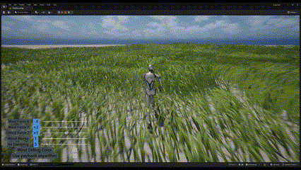
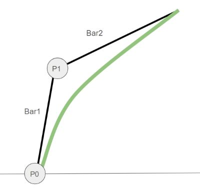
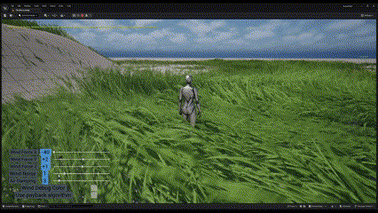
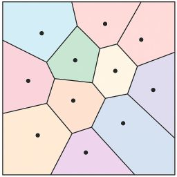
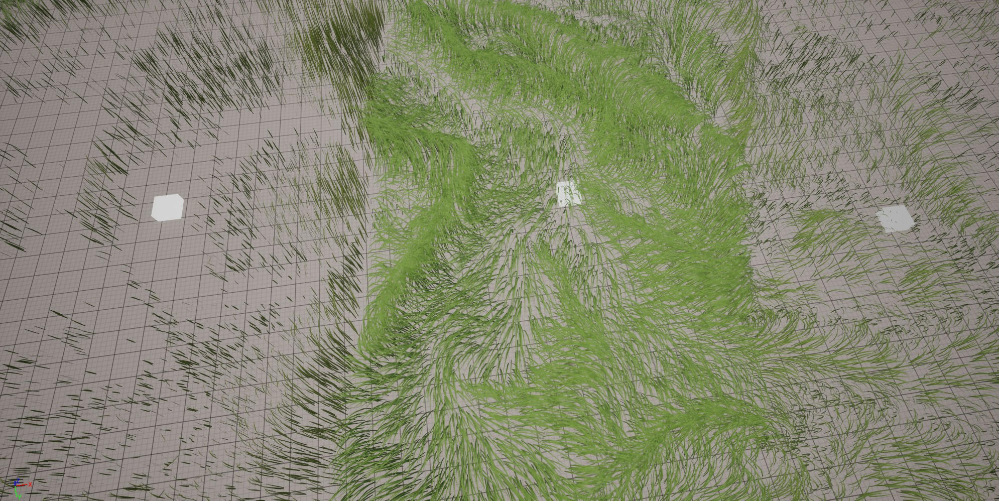
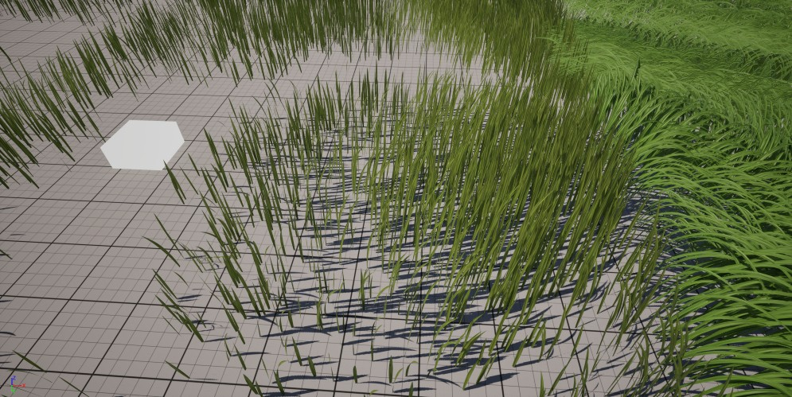

# 🎮 언리얼 엔진 5에서의 다중 강체 동역학 기반 풀 움직임 시스템

> *Ghost of Tsushima*에서 영감을 받은 물리 기반 풀 애니메이션 시스템을 언리얼 엔진 5, Niagara, PCG, 다중 강체 동역학을 활용해 구현한 프로젝트입니다.

## 📽️ 데모 영상
[🔗 YouTube에서 보기](https://youtu.be/5h7HZT5iuCI?si=WpGUy6z84sb_mj0Y)

  
  

## 🔗 소스 코드
[GitHub 저장소](https://github.com/donguklim/Ghost-of-Tsushima-Grass-plus-Rotational-Dynamics) – 알고리즘 상세 설명이 포함된 README 파일 포함

---

## 프로젝트 목표
- 언리얼 엔진 5로 *Ghost of Tsushima* 스타일의 풀 구현
- Niagara 데이터 채널(NDC)과 PCG 조합의 실시간 GPU 시뮬레이션 능력 시연

---

## 🧠 프로젝트 요약

- *Ghost of Tsushima* GDC 발표자료 기반
- 계층적 PCG + Niagara + 물리를 활용한 실시간 풀 생성 및 모션 시스템
- **Articulated Body Algorithm (ABA)**를 적용하여 물리적 사실감 강화
- 독자적인 개선 사항 구현:
    - **2차 베지어 곡선**을 이용한 고정 길이 풀
    - ABA 기반 물리 동역학 모션
    - 관절 최대 각도 변위에 대한 물리적 제약
    - 각변위 기반 풀 잎 회전 추가

---

## 🛠️ 주요 기능

### 🌱 풀 모델링 및 최적화
- 런타임 스폰/클린업을 위한 **계층적 PCG 그리드**
- **2차 베지어 곡선**을 사용한 풀 블레이드 모델링
    - *Ghost of Tsushima*의 3차 베지어와 달리 길이 고정 유지

  
**베지어 곡선 예시:** P0, P1 지점이 회전 관절로 작동합니다.

### 💨 바람 및 움직임 시뮬레이션
- 노이즈 함수를 이용한 바람 시뮬레이션
- 스켈레톤 기반 관절 구조:
    - P₀: 볼 조인트 (자유도 3)
    - P₁: 힌지 조인트 (자유도 1)
- 초기 자세로 복원되는 탄성 복원력 (강도는 무작위화)
- 작용하는 힘:
    - 바람 힘 (UI로 조정 가능)
    - 공기 저항 (UI로 조정 가능, 감쇠 역할)
    - 관절에서의 복원력

### ⚙️ 물리 시스템
- [SIGGRAPH 논문](https://dl.acm.org/doi/10.1145/2856400.2876008)을 참고하되 개선 적용
- 원 논문의 부정확하거나 불안정한 요소 제거
- 다음과 같이 대체:
    - **ABA를 이용한 정방향 동역학**
    - 각도 변위 최대 값 제한 제약
    - 지면 충돌 처리

---

## 🔌 Niagara 데이터 채널 + PCG 통합

- Niagara 이미터가 PCG 그리드 기반으로 동적 생성
- ABA 기반 모션 데이터(각속도, 가속도, 변위)를 Niagara에서 계산
- 카메라 위치 기반으로 이미터 및 파티클 자동 정리
- 커스텀 워크플로우:
    - PCG가 **Niagara 데이터 채널**에 데이터 작성
    - Niagara가 실시간으로 해석 및 시각화
    - 이미터는 카메라 위치와 방향에 따라 파티클 또는 자신을 제거

---

## 🦾 움직임 비교

### 강한 바람에서의 움직임

**최대 각도 변위 제한 및 충돌 처리 전**

  
[🔗 YouTube에서 보기](https://youtu.be/sHjHLRHukEs)  
[🔗 바람 강도 40부터 보기](https://youtu.be/sHjHLRHukEs?si=raVWfqdE0HeZyLcM&t=68)

**최대 각도 변위 제한 및 충돌 처리 후**

  
[🔗 데모 영상 (바람 강도 40부터)](https://youtu.be/5h7HZT5iuCI?si=dYmNk5WoUefEqJj9&t=36)

제한이 없을 경우:
1. 제한 받지 않고 끊임없이 회전하고 꼬여질 수 있는 풀은 무한한 복원력을 저장할 수 있음
   - (실제 였다면 풀은 그렇게 되기 전에 이미 부러졌을 것)
2. 그로인해 바람 움직임과 일치하지 않는 부자연스러운 모션 발생

### 참고 논문 결과 비교

참고 논문에서 다음과 같은 사항을 수정하였을때의 결과
- 계산 오류 수정
- 모순적인 알고리즘 제거 및 다음으로 대체:
    - 각도 제한
    - 지면 충돌
- 풀 길이 고정 적용

[🔗 YouTube에서 보기](https://youtu.be/qu_WTiCiIrc)  
[]

강한 바람 속에서는 풀이 직선 형태로 정렬되는 경향을 보입니다.

---

## 🧪 보로노이 기반 절차적 다양성

  
**보로노이 예시:** 동일한 가장 가까운 포인트를 공유하는 위치들은 같은 영역에 속합니다.

PCG로 생성한 보로노이 구역을 통해 다음 요소에 다양성 부여:
- 풀 길이
- 너비
- 강성
- 초기 방향
- 색상 노이즈
- 개체 밀도

일부 특성은 선형 보간으로 부드럽게 전환:
- 개체 밀도
- 풀 길이

  
**풀 보로노이 구역 예시:** 박스 메시는 보로노이 포인트 위치. 세 개의 영역이 색상, 형상, 밀도가 다름

  
**선형 보간 예시:** 중심(하얀 박스)에서 경계로 갈수록 풀 길이가 점차 변화

---

## ⚔️ *Ghost of Tsushima*와 비교

| 기능                            | Ghost of Tsushima        | 본 프로젝트 구현                      |
|---------------------------------|---------------------------|--------------------------------|
| 베지어 곡선 타입                | 3차 (4 포인트)           | 2차 (3 포인트)                     |
| 풀 길이                         | 제어 안됨 (가변적)        | 고정 길이                          |
| 움직임                          | 불명                      | ABA 기반 다중물체 역학 포워드 시뮬레이션       |
| 런타임 생성 방식                | 커스텀 엔진               | UE5 PCG + Niagara 데이터 채널 인터페이스 |

---
## 🚀 Performance

[GitHub 샘플 프로젝트](https://github.com/donguklim/Ghost-of-Tsushima-Grass-plus-Rotational-Dynamics)를 사용해,
고정된 PCG **클린업 멀티플라이어 값 (1.1)**과 다른 각 PCG 그리드 사이즈별 **샘플링 레이트**에 따른 FPS를 측정하였습니다. 

각 그리드 사이즈는 아래의 고정된 PCG 생성 radius를 사용합니다.:

| PCG 그리드 사이즈 | 생성 Radius |
|-------------|-----------|
| 400         | 1600      |
| 800         | 3200      |
| 1600        | 6000      |
| 3200        | 8000      |

> *(“n SR” = n 사이즈 그리드의 샘플링 레이트)*  
> FPS는 플레이 시작 몇 초 후에 측정되었습니다.

---

#### 📊 RTX 2080 TI를 사용한 FPS 결과 (각 그리드 사이즈별 1제곱 미터당 샘플링 레이트에 따라)

| **FPS 범위** | **400 SR** | **800 SR** | **1600 SR** | **3200 SR** |
|------------|------------|------------|-------------|-------------|
| 60 – 70    | 32         | 16         | 8           | 4           |
| 65 – 75    | 16         | 8          | 4           | 2           |
| 68 – 78    | 8          | 4          | 2           | 1           |
| 75 – 80    | 2          | 1          | 1           | 1           |
---

## 🤔 문제 해결 사례

### 물리적으로 정확한 알고리즘 탐색

참고 논문이 몇 가지 물리 요소를 무시하고 있다는 것을 알았지만, 이를 정확하게 계산하는 방법을 몰랐습니다.

#### 해결 과정

1. AI (Claude)에게 질문
2. 신뢰할 수 없는 답변과 hallucination
3. 이 문제의 전문 용어와 연구 분야 질문
4. “Multi-body dynamics”라는 키워드 획득
5. 검색해보니 정확히 필요한 분야였음
6. 4일간 튜토리얼 및 기본 개념 학습
7. ABA 구현 가능한 수준의 이해도 확보

### PCG와 Niagara 파티클 클린업

Static Mesh Spawner와 달리 PCG는 Niagara 파티클을 정리할 수 없음.  
파티클 중복 생성을 방지하려면 Niagara 이미터가 직접 정리해야 함.

#### 해결 방법

1. 파티클이 속한 PCG 그리드와 카메라 간 거리 기준으로 제거
2. 파티클 생성 시간과 마지막으로 PCG가 데이터를 보낸 시점 비교
    - NDC 범위가 PCG 그리드 크기와 일치해야 함
    - 캐릭터가 빠르게 이동하거나 텔레포트하는 경우엔 문제 가능
    - 자세한 내용은 [튜토리얼 영상](https://youtu.be/C1LmzQKNnzI) 참조

NDC에 PCG에서 직접 쓰는 기능은 신규 기능으로 튜토리얼이 없어 직접 시행착오를 겪으며 알아냄.  
이를 바탕으로 다른 사람에게 도움이 될 수 있도록 튜토리얼 제작:  
[🔗 PCG + Niagara 데이터 채널 튜토리얼](https://youtu.be/C1LmzQKNnzI)

---

## 🔮 향후 발전해야할 부분
- Render Target 또는 추가 NDC 사용하여 플레이어 및 오브젝트와의 상호작용 구현
- 풀 파편 바람 효과 추가
- 더 다양한 형태의 풀 모델 추가
- Nanite 활용하여 최적화 개선
- 그림자 품질 개선

---

## 🛠️ 사용 플러그인
- Niagara
- PCG
- PCGNiagaraInterop (experimental)
    - PCG에서 NDC로 데이터 쓰기 가능
- PCGExtendedToolkit
    - 보로노이 구역 생성에 사용

---

## 📚 참고 자료

- [GDC Presentation – Procedural Grass in *Ghost of Tsushima*](https://youtu.be/Ibe1JBF5i5Y?si=EbGqmGS29uNdBPUn)
- [SIGGRAPH Paper – Grass Swaying with Dynamic Wind Force](https://link.springer.com/article/10.1007/s00371-016-1263-7)
- [Unreal Engine Documentation – Niagara Data Channels Intro](https://dev.epicgames.com/community/learning/tutorials/RJbm/unreal-engine-niagara-data-channels-intro)

---

## 다른 포트폴리오

- [Implementation Photon Mapping & Disney's Photon Beam PBR with DirectX 12](https://github.com/donguklim/DirectX12PhotonBeam)
- [Implementation Photon Mapping & Disney's Photon Beam PBR with Vulkan](https://github.com/donguklim/vk_raytracing_tutorial_KHR/tree/master/photon_beam)
